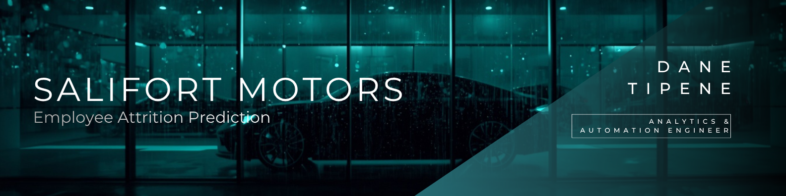

*Can you predict who's about to quit before they do?*

---

## Overview

Employee turnover at Salifort Motors was expensive and disruptive — and largely predictable, if you had the right model. The HR team needed to understand who was at risk of leaving, why, and what could be done about it before a resignation letter landed on their desk.

I conducted a full analytics lifecycle engagement — from problem definition and stakeholder alignment through to model development, evaluation, and executive delivery. Four models were tested against workforce data. XGBoost emerged as the clear winner. Key drivers of attrition — tenure-based risk, workload burnout, career stagnation, and compensation gaps — were isolated and translated into specific, actionable HR recommendations.

**The result:** A predictive model achieving 96.7% AUC-ROC — a reliable early warning system for HR decision-making, with concrete recommendations that give leadership a clear path to improving retention before attrition becomes a cost problem.

**Tools:** Python · XGBoost · Random Forest · Scikit-Learn · Seaborn · Jupyter Notebook

---

 

## Deliverables

**1. Project Workflow**  
[View →](https://1drv.ms/x/c/7fc1e21a85c52ea2/IQTlVCY1AgC3QafVgh1MDYeTAauPuurRpmOarZzH3q-GI8U?em=2&wdAllowInteractivity=False&wdHideGridlines=True&wdHideHeaders=True&wdInConfigurator=True&wdInConfigurator=True) Structured project plan detailing each phase from proposal through to model deployment — the roadmap that kept the engagement on track.

**2. PACE Strategy Document**  
[View →](Resources/PACE_Strategy_Document_Salifort.pdf) High-level strategic plan defining the problem, objectives, methodology, and expected business impact before any analysis began.

**3. Project Proposal**  
[View →](Resources/Project_Proposal_Salifort.pdf) Formal proposal outlining scope, key deliverables, stakeholder considerations, and timeline.

**4. Data Cleaning**  
[Jupyter Notebook →](Resources/JPNB_Data_Cleaning.ipynb) Preprocessing steps applied to ensure data accuracy — missing values, feature engineering, and dataset transformations documented in full.

**5. EDA & Visualisation**  
[Jupyter Notebook →](Resources/JPNB_EDA.ipynb) Exploration of key attrition trends and patterns using visualisations and statistical analysis to inform model development.

**6. Model Development**  
[Jupyter Notebook →](Resources/JPNB_Model_Development.ipynb) Full modelling process — feature selection, training across four model types (Logistic Regression, Decision Tree, Random Forest, XGBoost), hyperparameter tuning, and evaluation.

**7. Executive Report**  
[View →](https://www.canva.com/design/DAGgDgFKfWY/9Zz-sN37dAtV2MHR21pbYw/view?utm_content=DAGgDgFKfWY&utm_campaign=designshare&utm_medium=link2&utm_source=uniquelinks&utlId=h0c8b74c729) Concise business report summarising findings, model performance, and actionable HR recommendations for reducing attrition risk.

**8. Slide Presentation**  
[View →](https://www.canva.com/design/DAGgDslLy2Q/OJxVu1KgBz91a2crJsjsdQ/view?utm_content=DAGgDslLy2Q&utm_campaign=designshare&utm_medium=link2&utm_source=uniquelinks&utlId=h4f61f6a9d5) Visual summary of key project insights in a carousel format — built for stakeholder communication and public sharing.

---

 

*Built by [Dane Tipene](https://github.com/DataDaneHQ) · Analytics & Automation Engineer*

***License:*** *All rights reserved. No part of this repository may be reproduced, distributed, or transmitted in any form or by any means without the prior written permission of the owner.*